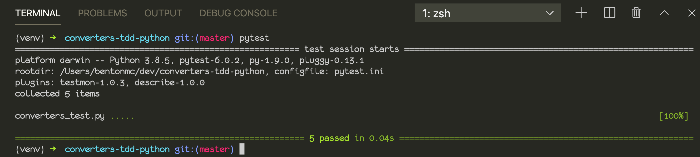

# Units Conversion Library following TDD with Python

It's really important early on in your coding career to instill GOOD habits like writing unit tests. TDD, or test-driven development, is the process of starting by writing a failing test, then writing just enough code to make it pass, then refactoring it until it is correct, well-tested, and well-formatted before going on to the next part of your program.

This is a small library of units conversion functions designed to be useful to a physicist, engineer, chemist, or other scientist. The process of writing this code exposed the importance of being cognizant of significant digits and the dangers of rounding off too early or using approximations that are too rough.

Here is a screenshot of the tests running successfully:

The most interesting thing I noticed while developing this project is that the units conversion tool on Google (specifically PSI => KPa) produces potentially inaccurate results. When I did the same calculation by hand, I found that even when you round, you don't get the same answer. That undoubtedly means that there's a problem with the precision somewhere, but I did not figure out whether or not it is a problem with the various conversion constants I looked up or if Google's conversions are just being rounded off too soon somewhere.
